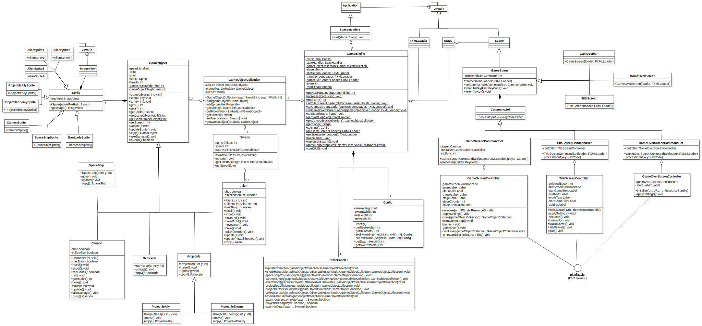

# SpaceInvaders in JavaFX!

This project consists of a fully functional Space Invaders game implemented in JavaFX.

## Class UML of the project

# How to use it

The game was made using the NetBeans IDE and uses JavaFX with FXML features in Java 8, so it needs to be built locally either in NetBeans or manually by the user accounting for the libraries used.
Once built, the game can be executed normally.

## Title Screen
The game starts on this screen. Here you will be able to see your local Hi-Score and will have two options to select, either Start Game or Quit whose functionality is evident from the names. 
In order to interact with this screen, you can use the UP and DOWN arrowkeys to cycle through the option and press ENTER to select the current highlighted one.

### Controls
- UP arrowkey -> highlights the option above of current
- DOWN arrowkey -> highlights the option below of current
- ENTER -> selects the option highlighted

## Main Game Screen
Once the Start Game button has been pressed on the Title Screen, the user will be redirected to this screen. Here is where the main game occurs.

### General description
Just like the original arcade Space Invaders, there will be a swarm of aliens on the screen and the player will control a cannon at the bottom of the screen. The objective here is to destroy the entire swarm before it kills the player either by depleting their lives shooting them or by reaching the barricades as the swarm slowly descends through the screen.

### Score counting
The player's cannon can shoot projectiles in order to destroy the aliens, by destroying aliens of the two bottom-most rows, the player will receive 10 points for the score for each killed alien, for the 2 rows atop the player will receive 20 points and for destroying the aliens on the top-most row, the player will receive 30 points.
There are also special space ships that spawn randomly at the top of the screen that if destroyed will give the player 50 points. 

### Passing levels
If the player succeeds in killing the entire alien swarm, the game's stage counter will increment by one and a new swarm will be spawned.

### Dying
The player starts the game with 3 lives that are shown at the top-right corner of the screen. Everytime the player gets hit by a projectile, they will return to the center of the screen and lose 1 life. If the life counter reaches 0, the user will be redirected to the game over screen.

### Game controls
- LEFT arrowkey -> moves Cannon to the left
- RIGHT arrowkey -> moves Cannon to the right
- Z -> makes Cannon shoot
- ESCAPE -> pauses the game

## Game Over Screen
This is the last screen to appear on the game once the player has lost it. It shows the player score and if it is higher than the previous Hi-Score, the current score will be saved as the new Hi-Score. From here, the only option the user has is to quit the game pressing ENTER.

### Contols
- ENTER -> quit game

# What's left to do?
- [ ] The game code was first planned for a command line application and the JavaFX layer was added layer, because of this, the code has some redundancies, specially in StateHandler.java. That said, it would be a good thing to refactor the code for a JavaFX only logic in order to organize and unbloat it, since the command line version idea was abandoned.
- [ ] Implement sprite-changing animations.
- [ ] Implement game audio.
